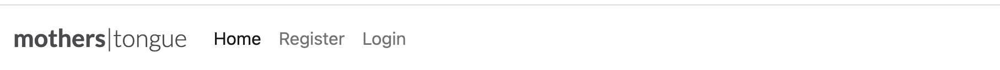

# Mother's Tongue Blog
Mother's Tongue is a community blog application that was built for young learners who is seeking to improve their knowledge of yoruba language.

 to read and learn in your
This project is focused on on a website that teaches kids between the ages of 3-15years on how to read and speak the indigenous Yoruba Language. Our website is built for parents, guardians, children and schools that are interested in sustaining the indigenous language.

 The users will find all relevant information about the Yoruba Language club; our offerings, meeting times, and a sign up form. 

 The idea behind the project is to be able to sustain the yoruba language for generations to come. 

https://kiksgold.github.io/Yoruba-language-club/

## Our Main goal:
<ul>
<li> to sustain the indigenous yoruba langauage
<li> to support parents, guardians and schools that wants their kids to learn the language.
<li> to be accessible to our target audience in their various locations.
</ul>

### Content Strategy
<ul>
<li> user-friendly
<li> stand-out design with beautiful colors
<li> easy to use navigations
</ul>

### Target Audience:
Our website is targeted at young parents, guardians who would like their kids to learn the yoruba language.

#### User Story:
<ul>
<li> The home page shows an image of kids studying, this provides potential users that the language club is for kids. </li>
<li> users are able to navigate our through our webpages. </li>
<li> Users get more info about our club days. </li>
<li> Users get more info about what we offer. </li>
<li> There is list of our social media icons that takes users to our various social media pages. </li>
<li> Our sign up page, is a call to action for users to enrol their kids in our club. </li>
</ul>

## Wireframes

## Features
<ul>
<li> Navigation
    <ul>
    <li> This features at the top of the page, it shows the club name at the left corner: Yoruba Language Club that links to the top of the page.
    <li> The other navigation links are to the right: Home, About us and Sign up. The home is the landing page, the about us and sign up links to another pages set up for About us and Sign up Form.
    <li> The navigation tells the user the name of the club and website and makes the differnt pages easy to find.
    <li> Users can easily navigate back to the main page from the About us page and sign up page.
    </ul> 

<li> The Header
    <ul>
    <li> The header shows the name of the club using a very dark shade of lemon color.
    <li> It explains the age brackets for the kids 3- 15years.
    <li> It also features a provoking thought on sustaing the yoruba club which also has an embedded link to the About us page.
    <li> The section provides users with clear information about what the site is and who the club is for.
    </ul>

<li> The About us
    <ul> 
    <li> The About us section gives details about what the club offers, their members and the club's schedule.
    <li> This section shows the user the important information they need to know about the club.
    </ul>

    

<li> The Sign up Form
    <ul>
    <li> it allows users to enroll and join our club
    </ul>

<li> Social media links
    <ul> 
    <li> This section has the social media icons, so users can find more information about the yoruba club on facebook, instagram, twitter and youtube.
    <li> The icons when click on takes the user to the respective url.
    <li> It gives the users ability to find and contact the club if they need to.
    </ul>

</ul>

## Testing
<ul>
<li> The page works in different browser; Chrome, Safari, and my mobile device (iPhone11). </li>
<li> I confirm that this project is responsive, looks good and functions on all standard screen sizes using devtools device toolbar. </li>
<li> I have used the http://ami.responsivedesign.is/ website to check the render on different sceens. </li>
<li> I have tested that the navigation, header, about us, sign up text are all readable and easy to understand. </li>
<li> The sign up form works, it requires entries in every field and will only accept an email in the email field, the submit button also works. </li>
</ul>

## Challenges
The major challenge that I experienced was media screen responsiveness.
<ul>
<li> I was able to get support from Tutor me and my mentor </li>
<li> I also used chrome dev tools to carefully choose devices to work on my 3pages and their alignment. </li>
</ul>

## Validation
<ul>
<li>HTML </li>
<ul>
<li> No errors were returned when passing through the official W3C validator. </li>
</ul>
<li>CSS </li>
<ul>
<li> No errors were returned when passing through the official W3C validator. </li>
</ul>
<li>Accessibilty</li>
<ul>
<li> I confirmed that the colors and fonts chosen are easy to read and accessible by running it through lighthouse in devtools. </li>
</ul>

</ul>

## Technology Used
<ul>
<li> Balsamiq Wireframes: this was used to originate the idea, the mainframes for this project to have a better picture of the end project.</li>
<li> HTML: we used this to build all the webpage for this website. </li>
<li> CSS: this was used to style our various pages. </li>
<li> Gitpod: is an online IDE for GitHub and GitLab that launches ready-to-code dev environments for any project with a single click. www.gitpod.io www.gitpod.io </li>
<li> Github: provides hosting for software development version control using Git. www.github.com </li>
<li> Chrome Dev Tool: this was used extensively to test debug my code. </li>
<li> W3C Markup validation service: it was used to test my html and css codes for validation. https://validator.w3.org/ </li>
</ul>

## Deployment
The site was deployed to GitHub Page. The following steps were taken for deployment:
<ul>
<li> I created a repository on mygithub </li>
<li> I have saved, commited and pushed every changes to github.</li>
<li>In the github repository I navigated to the settings tab </li> 
<li> I used the drop-down menu to select master branch as a publishing source and saved it. </li>
<li> Refreshed the github page, and a link was provided to the completed website https://kiksgold.github.io/Yoruba-language-club/ </li>
</ul>

## Credit
<ul>
<li> ReadMe template from The coding club. </li>
<li> The Love Running Project</li>
<li> Fontawesome </li>
<li> W3schools for my code referencing https://www.w3schools.com/howto/ </li>
<li> Adobe Stock for all my images https://stock.adobe.com/ng/Libraries </li>
</ul>

## Acknowledgment 
<ul>
A special thanks to my hubby for his all round support in making sure this project was a success. Thanks for all the cup of Teas.