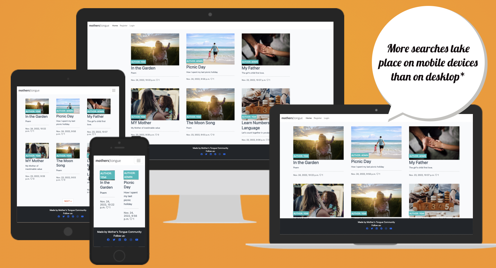
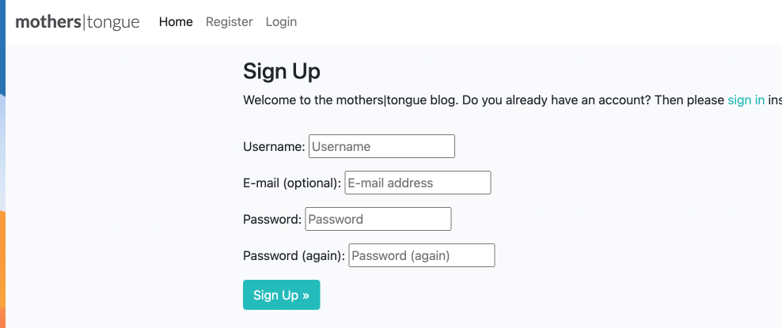
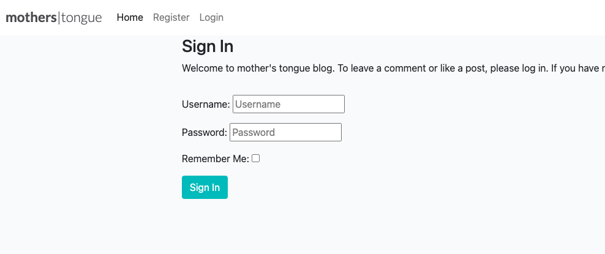
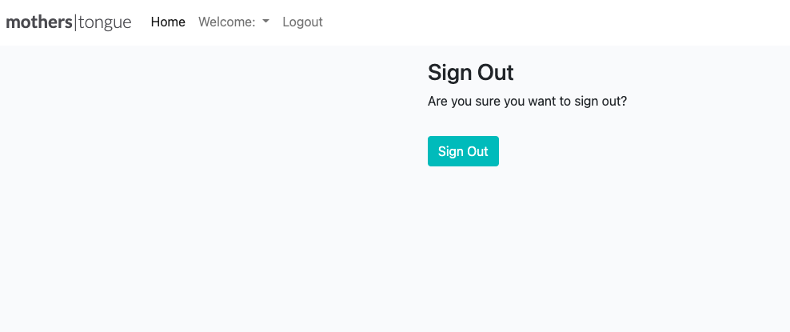
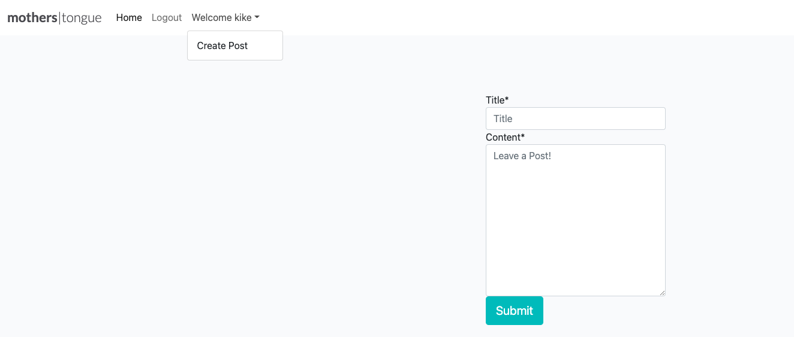
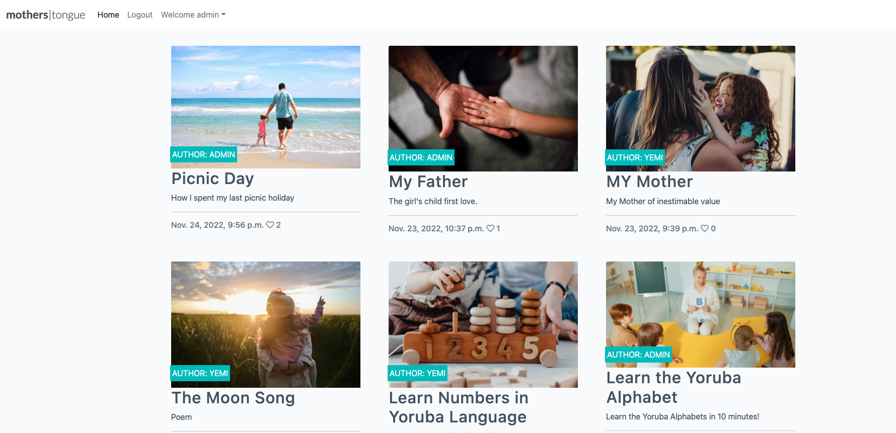
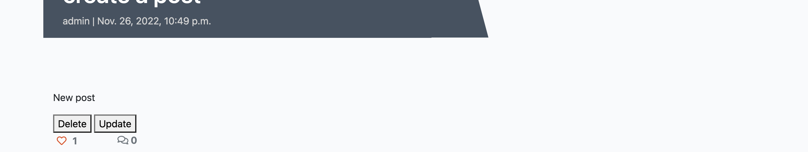
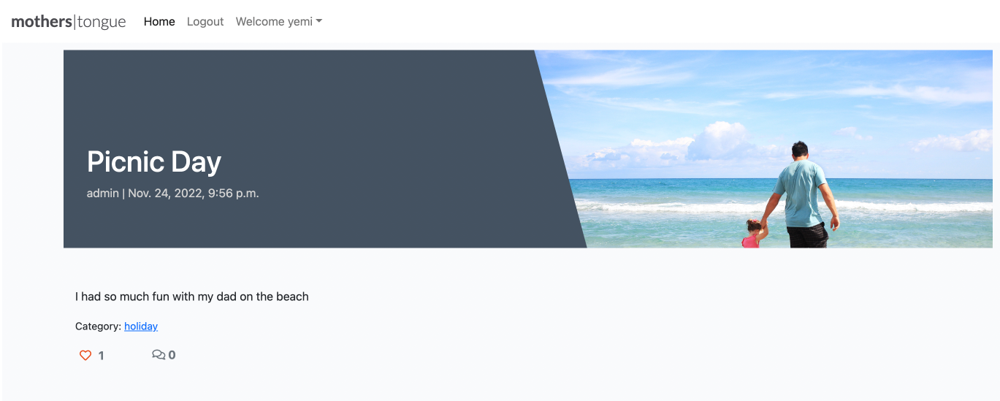
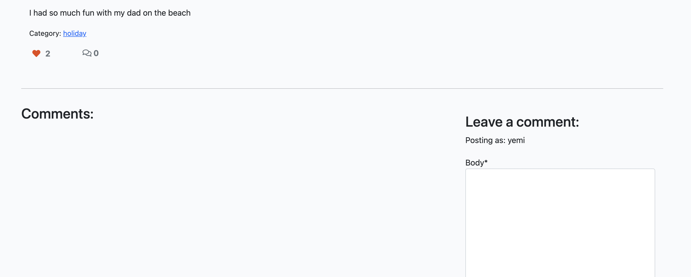
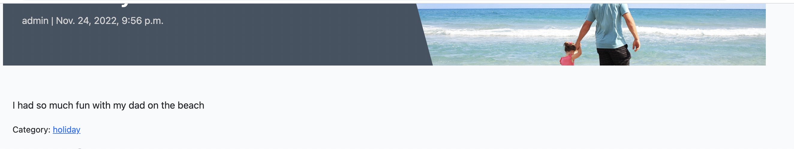

# Mother's Tongue Blog
Mother's Tongue is a community blog application that was built for young learners who is seeking to improve their knowledge of yoruba language.
The blog application consists of posts with series of subjects or topics that are explained for users in yoruba.

 To intereact with the post, users will have to signup to enable them to drop their comments and like any post. 

 Users can also create post, read comments update and delete post 

 The users will find links to the application below. 

 The idea behind the project is to build a community of nartive speakers of the language. 

https://mothers-tongue.herokuapp.com/

## Our Main goal:
<ul>
<li> to build a community of indigenous yoruba learners and tutor
<li> to support parents, guardians and schools that wants their kids to learn the language.
<li> to be accessible to our target audience in their various locations.
</ul>

### Content Strategy
<ul>
<li> user-friendly
<li> stand-out design with beautiful colors
<li> easy to use navigations
</ul>

### Target Audience:
Our application is targeted at young learners who can interact within the community 

## User Story
<ul>
<li> Account Registeration

    As a Site User I can register an account so that I can interact with the blog

<li> Login

    As a Site User I can sign into an existing account so that I can interact with the blog

<li> Logout

    As a Site User I can signout of an account so that I can stop interacting with the blog

    

<li> Create a post

    As a Site User I can create post, so that I can upload blog posts. 
    

<li> Retrieve a post

    As a Site User I can retrieve post, so that I can view a list of posts.

<li> Update a post

    As a Site User I can update post, so that I can view the post list.

<li> Delete a post
    
    As a Site User I can delete post, so that I can delete unwanted blog post.  

<li> Like a post

    As a Site User I can like a post so that I can interact with the content 

<li> Unlike a post
    
    As a Site User I can unlike a post so that I can interact with the content 

<li> Leave a comment
    As a Site User I can leave comments on a post so that I can be involved in the conversation

<li> View category post

    As a Site User I can view category post, so that I can see similar posts to read. 

<li> Social media links
    <ul> 
    <li> This section has the social media icons, so users can find more information about the blog on facebook, instagram, twitter and youtube.
    <li> The icons when click on takes the user to the respective url.
    <li> It gives the users ability to users to folluw us on all our socia media links.
    </ul>

</ul>

## Testing
<ul>
<li> The page works in different browser; Chrome, Safari, and my mobile device (iPhone11). </li>
<li> I confirm that this project is responsive, looks good and functions on all standard screen sizes using devtools device toolbar. </li>
<li> I have used the http://ami.responsivedesign.is/ website to check the render on different sceens. </li>
<li> I have tested that the navigation, home, login, logout, signup, create post button are all readable and easy to understand. </li>
<li> All the forms work perfectly well. </li>
</ul>

## Challenges
The major challenge that I experienced was timing.
<ul>
<li> Timing </li>
<li> I'm unable to create the update post function </li>
</ul>

## Validation
<ul>
<li>HTML </li>
<ul>
<li> No errors were returned when passing through the official W3C validator. </li>
</ul>
<li>CSS </li>
<ul>
<li> No errors were returned when passing through the official W3C validator. </li>
</ul>
<li>Accessibilty</li>
<ul>
<li> I confirmed that the colors and fonts chosen are easy to read and accessible by running it through lighthouse in devtools. </li>
</ul>
</ul>

## Technology Used
<ul>

<li> HTML: we used this to build all the webpage for this website. </li>
<li> CSS: this was used to style our various pages. </li>
<li> Gitpod: is an online IDE for GitHub and GitLab that launches ready-to-code dev environments for any project with a single click. www.gitpod.io www.gitpod.io </li>
<li> Github: provides hosting for software development version control using Git. www.github.com </li>
<li> Chrome Dev Tool: this was used extensively to test debug my code. </li>
<li> Bootsrap 5.0</li>
<li> Django 3.8</li>
<li> Psycopg database</li>
<li> manage.py</li>
<li> Fontawesome </li>
<li> Cloudinary Storage </li>
<li> ElephantSQL </li>
</ul>

## Deployment
The site was deployed to GitHub Page. The following steps were taken for deployment:
<ul>
<li> Steps for Deployment
</li>
    <ul>
    <li>Create a new app on Heroku
    </li>
    <li>Set my config vars to store my sensitive data
    </li>
    <li>Create the database on Elephant SQL
    </li>
    <li>Set debug to False in settings.py
    </li>
    <li>Click on deploy
    </li>
    </ul>
</ul>

## Credit
<ul>
<li> codestar walkthrough </li>
<li> Django Central</li>
<li> Django Central</li>
<li> Tutor support </li>
<li> W3schools for my code referencing https://www.w3schools.com/howto/ </li>
<li> Adobe Stock for all my images https://stock.adobe.com/ng/Libraries </li>
</ul>

## Acknowledgment 
<ul>
A special thanks to my hubby for his all round support in making sure this project was a success. Thanks for all the cup of Teas.